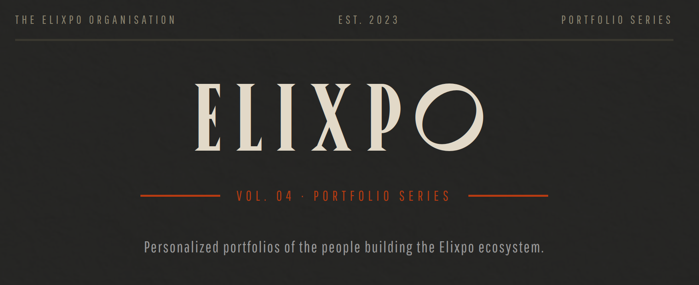
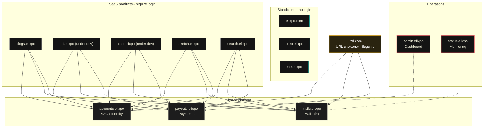

<!--
  ELIXPO README - follows the standard template (see elixpo/STANDARDS.md §4).
  Per-repo sections: About / product, Exclusive, and the stack-specific docs.
-->

<p align="center">
  
</p>

<h1 align="center">Elixpo Portfolios</h1>

<p align="center">
  <strong>The personalized portfolio platform for Elixpo members.</strong><br/>
  Free and open source, part of an ecosystem built by a global community of 45+ contributors.
</p>

<p align="center">
  <a href="https://me.elixpo.com">me.elixpo.com</a> ·
  <a href="https://elixpo.com">Elixpo</a> ·
  <a href="https://github.com/orgs/elixpo/discussions">Discussions</a> ·
  <a href="https://github.com/elixpo/elixpo_chapter">Monorepo</a> ·
  <a href="https://github.com/sponsors/Circuit-Overtime">Sponsor</a>
</p>

<p align="center">

[](https://nextjs.org/)
[](https://react.dev/)
[](https://tailwindcss.com/)
[](https://www.framer.com/motion/)
[](https://pages.cloudflare.com/)

[](LICENSE)
[](https://github.com/elixpo/elixpome)
[](https://github.com/elixpo/elixpome/commits/main)
[](https://github.com/elixpo/elixpome/stargazers)

</p>

---

## About

**Elixpo Portfolios** (package `elixpome`) is the unified portfolio platform for
the [Elixpo Organisation](https://elixpo.com). Each member gets a fully
personalized route at **[me.elixpo.com](https://me.elixpo.com)** with their own
homepage, about page, projects showcase, publications, and contact section — all
powered by simple JSON content files.

No CMS. No database. Just clean, static content that deploys to the edge.

> This repository is the source for **me.elixpo.com** — one of the standalone,
> login-free surfaces of the Elixpo ecosystem.

### Live deployments

| | Member | Portfolio | Role |
|---|--------|-----------|------|
|  | **Ayushman** | [`me.elixpo.com/ayushman`](https://me.elixpo.com/ayushman) | Founder & Lead Dev |
|  | **Anwesha** | [`me.elixpo.com/anwesha`](https://me.elixpo.com/anwesha) | Co-Dev & Admin |
|  | **Vivek** | [`me.elixpo.com/vivek`](https://me.elixpo.com/vivek) | Frontend Developer |

### Features

- **Dynamic routing** — each member gets `/{name}` with all sub-pages auto-generated
- **JSON-driven content** — update your portfolio by editing simple JSON files
- **Static export** — builds to pure static files, deployed on Cloudflare Pages
- **Drag-scroll sections** — spotlight, recommendations, and work experience scroll with mouse drag
- **Responsive design** — adapts from mobile to ultrawide displays
- **Paper-grain aesthetic** — vintage-inspired design with sepia tones and textured backgrounds

## The ecosystem

| Tool | What it does | Link |
| --- | --- | --- |
| 🎨 **Elixpo Art** | AI image generation _(under dev)_ | [art.elixpo.com](https://elixpo.com) |
| ✍️ **Elixpo Blogs** | A rich, modern writing and publishing space | [blogs.elixpo.com](https://blogs.elixpo.com) |
| 🖊️ **LixSketch** | A hand-drawn style whiteboard for ideas and diagrams | [sketch.elixpo.com](https://sketch.elixpo.com) |
| 💬 **Elixpo Chat** | A fluid, real-time AI chat experience _(under dev)_ | [chat.elixpo.com](https://chat.elixpo.com) |
| 🔎 **Elixpo Search** | Fast, AI-assisted search | [search.elixpo.com](https://search.elixpo.com) |
| 👤 **Elixpo Accounts** | One identity (SSO) across the ecosystem | [accounts.elixpo.com](https://accounts.elixpo.com) |
| 🔗 **lixrl** | Our flagship URL shortener | [lixrl.com](https://lixrl.com) |
| 🪪 **Portfolios** | Personal pages to showcase your work | [me.elixpo.com](https://me.elixpo.com) |
| 🐼 **Oreo** | The mascot's home | [oreo.elixpo.com](https://oreo.elixpo.com) |

Developers can drop our editors into their own projects with the
**`@elixpo/lixsketch`** and **`@elixpo/lixeditor`** packages, on npm and as VS
Code extensions.

## Architecture

Everything runs on **Cloudflare**. Three shared platform services back the
ecosystem, and products are either **SSO-backed SaaS**, **standalone**, or our
**flagship**:

- **`accounts.elixpo`** - single sign-on / identity
- **`mails.elixpo`** - shared mailing infrastructure
- **`payouts.elixpo`** - shared payments / payouts

SaaS products (Blogs, Art, Chat, Sketch, Search) and the flagship **lixrl.com**
all authenticate through Accounts (SSO) and share the Mail and Payouts infra.
The public, login-free surfaces (**elixpo.com**, **oreo.elixpo**, **me.elixpo**)
are standalone. **admin.elixpo** is the operations dashboard and
**status.elixpo** is monitoring.



A rendered, interactive version lives at **[elixpo.com/architecture](https://elixpo.com/architecture)**.

## Built by the community

Elixpo is made by people, in the open. **45+ contributors** have shaped these
tools, with a small core team steering the way:

- **Ayushman Bhattacharya** - Founder & Lead ([@Circuit-Overtime](https://github.com/Circuit-Overtime))
- **Vivek Yadav** - Lead Co-Dev ([@ez-vivek](https://github.com/ez-vivek))
- **Anwesha Chakraborty** - Core Maintainer ([@anwe-ch](https://github.com/anwe-ch))

Everyone is welcome. See **[CONTRIBUTING.md](CONTRIBUTING.md)** and our
**[Code of Conduct](CODE_OF_CONDUCT.md)**.

## Recognition & programs

Elixpo has taken part in and been supported by **GSSOC**, **Hacktoberfest**,
**Pollinations.AI**, **MS Startup Foundations**, and **OSCI**.

## Get involved

- 💬 **Join the conversation** in [GitHub Discussions](https://github.com/orgs/elixpo/discussions).
- 🚀 **Submit your project** to be featured across the ecosystem.
- 🛠️ **Contribute** - browse good first issues in the [monorepo](https://github.com/elixpo/elixpo_chapter).
- ❤️ **Support us** via [GitHub Sponsors](https://github.com/sponsors/Circuit-Overtime).

## Brand assets

Brand-ready marks and icons live under [`public/`](public/), and the brand
source of truth (mascot, palette, rules) is maintained in the
[elixpo](https://github.com/elixpo) site repo. A browsable kit is at
**[elixpo.com/assets](https://elixpo.com/assets)**. Generated image assets for
this repo are documented in [`assets.md`](assets.md).

## License

Elixpo uses one **licensing standard** across every repository:

- **Code** - [MIT](LICENSES/preferred/MIT) (with the [Oreo-trademarks exception](LICENSES/exceptions/Oreo-trademarks)).
- **Brand & visual assets** - [CC-BY-4.0](LICENSES/preferred/CC-BY-4.0) (with the same exception).

The Oreo mascot, the chest E-badge, and the "Elixpo" and "Oreo" names, domains,
and palette are reserved - this protects the brand and its royalties while
keeping the code and assets free. See [`LICENSE`](LICENSE) and the per-product
notice board, [`NOTICE`](LICENSES/NOTICE).

## Exclusive

> Per-repo "exclusive" artifacts (an npm package, a VS Code extension, a hosted
> SaaS, a paid tier) are declared here and in [`NOTICE`](LICENSES/NOTICE).

**This repository:** None - me.elixpo.com is an official hosted deployment; the
source is MIT.

---

## Running this site locally

```bash
npm install
npm run dev
```

Then open [http://localhost:3000](http://localhost:3000).

### Adding a new member

1. Create a new directory under `content/` with the member's name.
2. Add the required JSON files: `profile.json`, `home.json`, `about.json`, `projects.json`, `publications.json`, `spotlight.json`, `recommendations.json`, `work.json`, `connect.json`.
3. Add assets under `public/assets/{name}/`.
4. The member's portfolio will be available at `/{name}`.
5. Submit a PR with the new content and assets, and we'll review it for deployment.

<p align="center">
  <sub>Made in the open, together. © 2023-2026 Elixpo.</sub>
</p>
